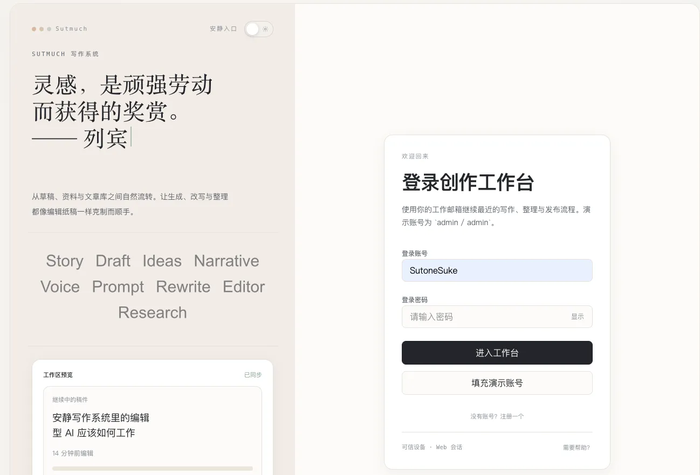
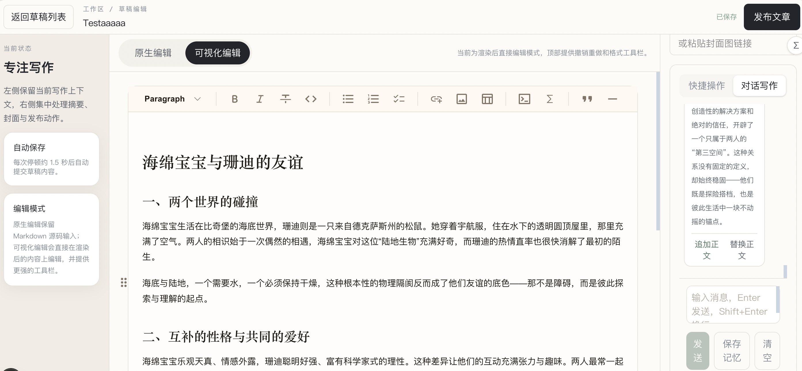
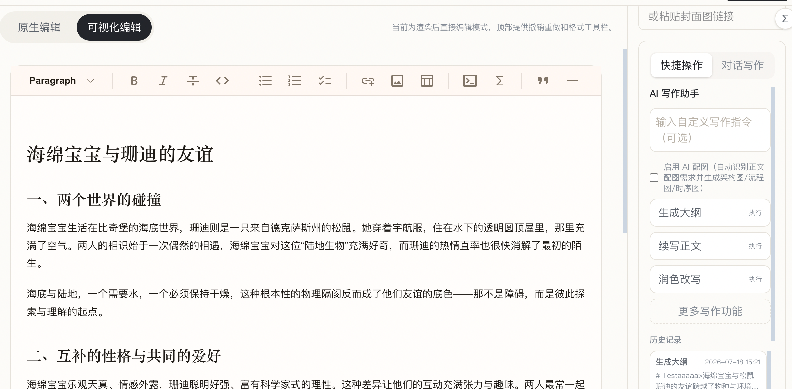
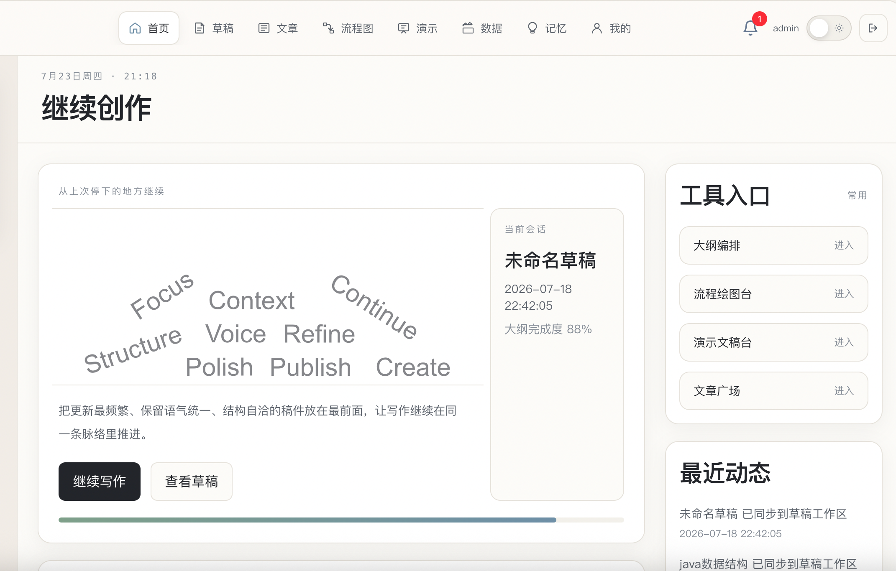
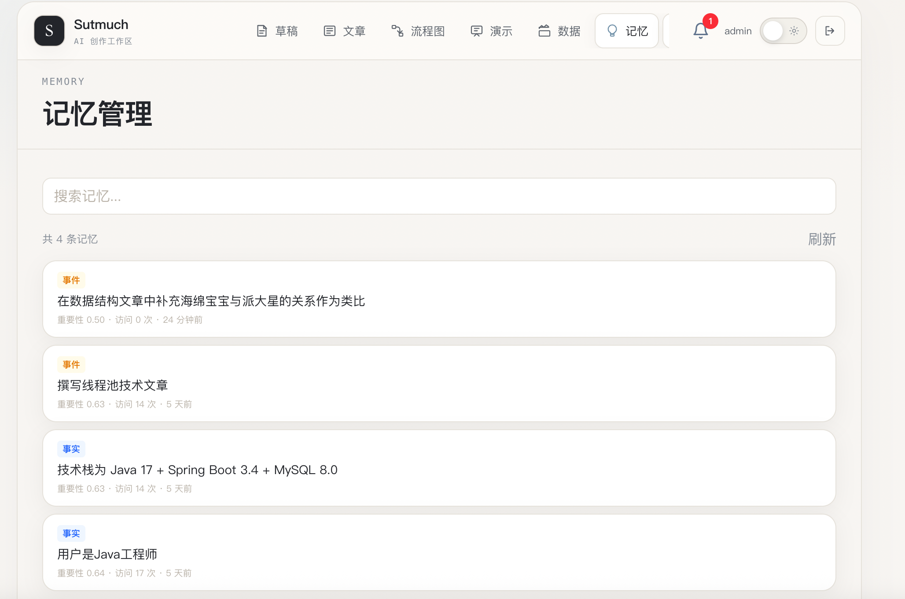
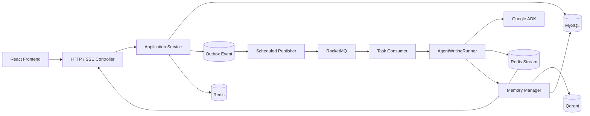

# 🤖 AgentWrite — Multi-Agent AI Writing Workbench

> **[English](README.md)** | [中文](README_CN.md)

> Orchestrate multiple AI agents to draft, expand, polish, and review technical articles — with personalized memory, streaming output, and async task execution.

[](https://github.com/hhhhaaaaaad/AgentWrite)
[](https://github.com/hhhhaaaaaad/AgentWrite/fork)
[](https://github.com/hhhhaaaaaad/AgentWrite/issues)
[](https://github.com/hhhhaaaaaad/AgentWrite/commits/main)
[](LICENSE)
[](https://www.oracle.com/java/technologies/javase/jdk17-archive-downloads.html)
[](https://spring.io/projects/spring-boot)
[](https://github.com/google/adk-java)

## ✨ Highlights

- 🧩 **Config-Driven Agent Assembly** — Agents, models, prompts, MCP tools, and workflows defined in YAML, assembled at startup via Google ADK
- 📡 **Streaming Output** — Real-time content delivery through SSE + Redis Stream with stage-aware event processing
- 🧠 **User Memory System** — Mem0-inspired hybrid retrieval (Vector + BM25 + Reranker) to personalize writing with user's tech background
- ⚡ **Async Long-Task Execution** — Transactional Outbox + RocketMQ decouples HTTP requests from multi-agent workflows
- 🎨 **Auto Diagram Generation** — Dedicated Draw.io Agent creates architecture/flow/sequence diagrams inline
- 📝 **Markdown Governance** — CommonMark AST rendering with rule-based normalization for code fences, lists, and headings

## 📸 Screenshots

| Login | Chat Writing | Quick Actions |
|:---:|:---:|:---:|
|  |  |  |

| Homepage | Memory Visualization |
|:---:|:---:|
|  |  |

## 🏗️ Architecture



## 🚀 Quick Start

### Prerequisites

- JDK 17+, Maven 3.8+, Docker 20+, Docker Compose v2+
- LLM API Key (for writing model)
- Embedding API Key (for memory system)

### 1. Start Infrastructure

```bash
cd docs/dev-ops
docker compose -f docker-compose-environment.yml up -d
```

This starts MySQL (13306), Redis (16379), RocketMQ (9876/10911), and Qdrant (6333).

### 2. Configure API Keys

```bash
export MEMORY_EMBEDDING_API_KEY="your_embedding_api_key"
export SUTONE_WRITING_MODEL_API_KEY="your_writing_model_api_key"
export SUTONE_DRAWIO_MODEL_API_KEY="your_drawio_model_api_key"  # optional
```

### 3. Build & Run

```bash
mvn -pl sutone-agent-bok-app -am clean package -Dmaven.test.skip=true
java -jar sutone-agent-bok-app/target/sutone-agent-bok-app.jar
```

The app runs at `http://localhost:8091`.

## 📦 Module Structure

```text
sutone-agent-bok
├── sutone-agent-bok-api              # External API interfaces, DTOs, response objects
├── sutone-agent-bok-types            # Shared enums, exceptions, base types
├── sutone-agent-bok-domain           # Domain entities, services, repositories, Agent logic
├── sutone-agent-bok-infrastructure   # MySQL, Redis, Qdrant, external service adapters
├── sutone-agent-bok-trigger          # HTTP, SSE, RocketMQ Consumer, scheduled tasks
└── sutone-agent-bok-app              # Spring Boot entry point & configuration assembly
```

The backend follows a DDD-style layered architecture, isolating domain logic from infrastructure adapters (MySQL, Redis, Qdrant, RocketMQ).

## 🛠️ Tech Stack

| Area | Technology |
| --- | --- |
| Backend | Java 17, Spring Boot 3.4.3, Maven |
| Agent | Google ADK 0.5.0, Spring AI, MCP, RxJava |
| Storage | MySQL, Redis / Redisson, Qdrant |
| Async & Streaming | RocketMQ, Redis Stream, SSE |
| Data Access | MyBatis, HikariCP |
| Deployment | Docker, Docker Compose |

## 🗺️ Roadmap

- [ ] Automated evaluation suite and quality metrics for Agent workflows
- [ ] Task trace, model latency, and token consumption monitoring
- [ ] Outbox retry, task recovery, and consumer idempotency tests
- [ ] Deployment documentation and API examples

## 🤝 Contributing

Contributions are welcome! Please read [CONTRIBUTING.md](CONTRIBUTING.md) for guidelines.

## 📄 License

This project is licensed under the [MIT License](LICENSE).

## ⭐ Star History

[](https://star-history.com/#hhhhaaaaaad/AgentWrite&Date)
